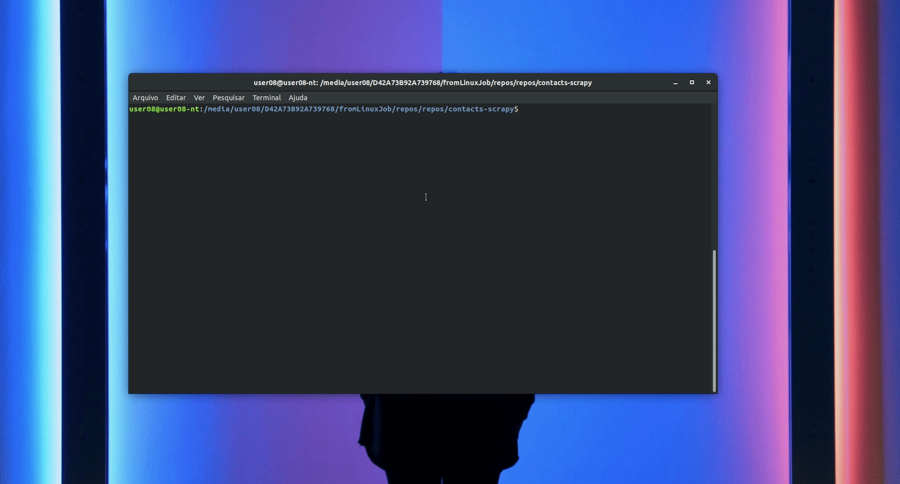

# contacts-scrapy
This is a Scrapy project to scrape phone and logo from any WEB site.

## Extracted data

This project extracts quotes, combined with the respective author names and tags.
The extracted data looks like this sample:

    {
      "logo": "https://www.illion.com.au/wp-content/uploads/2019/03/ION-RGB-Gradient-64.png", 
      "phones": ["+61871229452", "+64800836268", "+61398283200"],
      "website": "https://www.illion.com.au/contact-us/"
    }
    
## Spiders
This project contains only the **`contacts`** spider.

##  Requirements
- Python => 3.6
- Scrapy

## Install
To install the project run the commands on root directory:
- `python setup sdist`
- `pip install -U ./dist/contacts-scrapy-1.0.1.tar.gz`

    
## Running the spiders

You can run a spider using the `python -m` command, such as:

    $ cat websites.txt | python -m contacts
    
    
 

# Docker
Run the commands on root directory

## Build

    $ docker build -t contacts-scrapy .
    
## Run

    $ cat websites.txt | docker run -i contacts-scrapy
    
  
